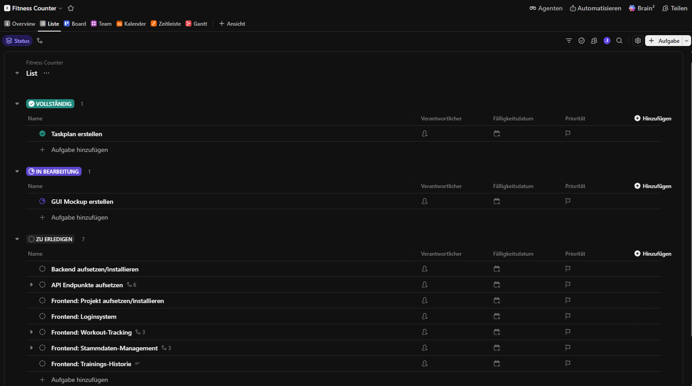
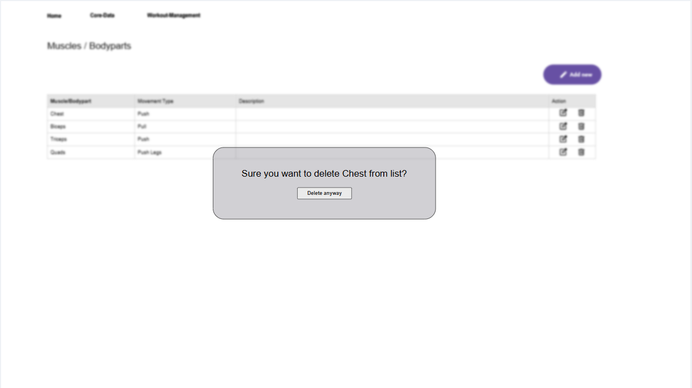
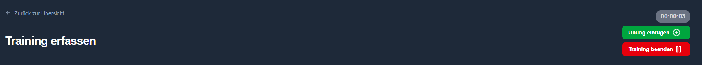
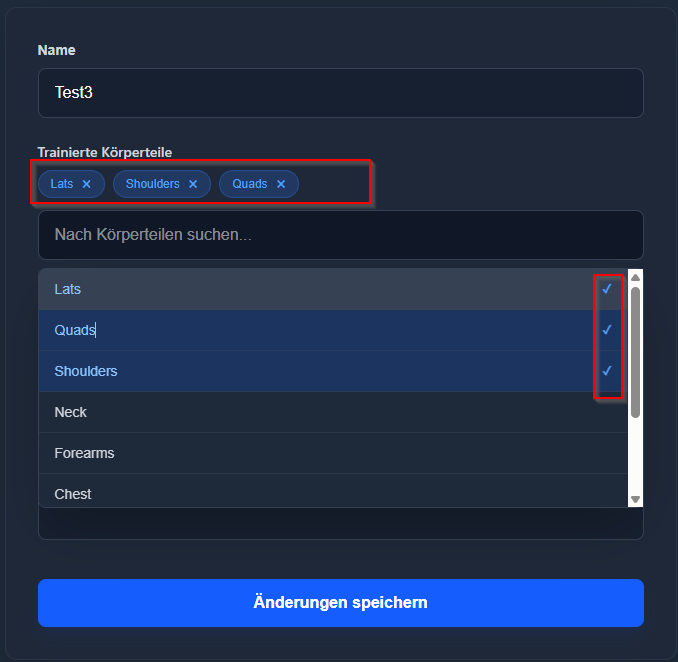

# **Dokumentation**

Mein Projekt besteht aus zwei Teilen: einem Backend, das die benötigten Daten in Form einer REST-API liefert, und einem Frontend, welches die Benutzeroberfläche anzeigt und die Daten über die API bezieht. Diese Dokumentation bezieht sich auf beide Teilprojekte.

**[Projekt-URL Backend](https://github.com/Jekathmenan/Fitness-Counter/)**

---

## **Planung**

### **Projektplanungstool**
Um die aufgewendeten **Zeiten** und die pendenten **Aufgaben** stets im Blick zu behalten, habe ich das Projekt mit der Suche nach einem passenden **Projektplanungstool** gestartet. Zunächst fiel die Wahl auf **[ClickUp](https://clickup.com/)**, wo auch der ursprüngliche Taskplan erstellt wurde.

Nach dem Erstellen des Zeitplans stellte sich heraus, dass die integrierte Zeiterfassung in der kostenlosen Version von ClickUp unübersichtlich gestaltet ist. Aus diesem Grund migrierte ich den Zeitplan zu **[Paymo](https://www.paymoapp.com/time-tracking-software/)**, da die Testversion deutlich mehr Flexibilität bot. Da die Testphase von Paymo jedoch nach 15 Tagen ablief und die Daten nicht mehr frei zugänglich waren, kehrte ich pragmatisch zu **ClickUp** zurück, um den Planungsaufwand gering zu halten und mich auf die Entwicklung zu fokussieren.

**[Link zum Taskplan](https://sharing.clickup.com/9015422760/l/h/4-901511187305-1/ae42dd8410d243e)**



### **GUI-Mockups**

Um mir selbst ein klares Bild von der Benutzeroberfläche zu machen, habe ich im Vorfeld Wireframes erstellt. Hierfür habe ich das Tool **[moqups](https://moqups.com/)** verwendet, mit dem ich bereits gute Erfahrungen gesammelt hatte. Es erlaubt das unkomplizierte Erstellen von übersichtlichen Wireframes und Diagrammen.

**[Link zum Mockup](https://app.moqups.com/jD5ptmTptbAE29nsAXXE8kunvxFvbbNF/view/page/ad64222d5)**



---

## **Meilensteine**

### **Backend / API**

#### **Einführung**

Da das Informatikstudium sehr Java-intensiv ist und ich gerne mit dieser Programmiersprache arbeite, fiel der Entscheid, das Backend mit **Java Spring Boot** zu realisieren.

**Eingesetzte Technologien:**
- Java Spring Boot
- PostgreSQL mit Docker

#### **Vorbereitungsarbeiten für das Projekt**

Bisher hatte ich noch keine praktische Erfahrung mit Spring Boot gesammelt. Um mich mit dem Framework vertraut zu machen, habe ich vorab ein **[Tutorial-Projekt](https://youtu.be/31KTdfRH6nY?list=PLt22FN3yHhCYIQsjjBLqMBh8YE2x80IGW)** von freeCodeCamp.org durchgearbeitet. Einsehbar ist meine Umsetzung im Repository **[Runnerz auf GitHub](https://github.com/Jekathmenan/Runnerz/)**.

#### **Loginsystem**

Aus bisherigen Projekten mit Drittanbieter-APIs war mir das Prinzip von Bearer-Tokens bekannt: Nach erfolgreicher Authentifizierung gibt die API ein Token zurück, das für eine definierte Zeitspanne gültig ist. Dieser Token wird im `Authorization`-Header künftiger Anfragen mitgesendet, um geschützte Endpunkte aufzurufen. Nach Ablauf der Gültigkeit muss eine erneute Anmeldung erfolgen.

Für dieses Projekt wurde ein entsprechendes Schema umgesetzt:
- Die Routen `/login` und `/register` sind öffentlich zugänglich.
- Bei erfolgreicher Authentifizierung wird ein JWT (JSON Web Token) ausgestellt.
- Alle fachlichen Routen verlangen ein gültiges Bearer-Token.

Da die vollständige Implementierung einer Spring-Security-Architektur mit JWT Neuland für mich war, habe ich die Architektur und Konfiguration mit Unterstützung von KI-Tools erarbeitet.

**Durchgeführte Schritte im Backend:**

1. **Maven-Dependencies einbinden:**
    - `spring-boot-starter-security`
    - `spring-boot-starter-data-jpa`
    - `spring-boot-starter-web`
    - `spring-boot-starter-validation`
    - `spring-boot-starter-oauth2-resource-server`
    - `postgresql`
    - `spring-boot-docker-compose`
    - `spring-boot-starter-mail` (für künftige Mail-Verifikation / Passwort-Reset)

2. **Package-Struktur aufsetzen:**
    - `config`: Zentrale Konfigurationsklassen (u. a. Security)
    - `controller`: REST-Endpunkte, die HTTP-Requests annehmen und delegieren
    - `service`: Geschäftslogik (Transaktionen, Validierungen, Berechnungen)
    - `model`: JPA-Entities zur Datenbankabbildung
    - `repository`: Spring-Data-Schnittstellen für den Datenzugriff
    - `dto`: Data Transfer Objects zur Entkopplung von interner Datenstruktur und API-Schnittstelle inkl. Validierungsannotationen
    - `exception`: Benutzerdefinierte Ausnahmebehandlungen (Custom Exceptions)
    - `util`: Wiederverwendbare Hilfsklassen

3. **User-Schema implementieren:** Erstellung des `User`-Entities und des dazugehörigen JPA-Repositories.
4. **SecurityFilterChain konfigurieren:** Definition der Zugriffsregeln und stateless Session-Management in der Klasse `SecurityConfig`.

> **Codeausschnitt Filterkonfiguration:**
```java
@Bean
public SecurityFilterChain securityFilterChain(HttpSecurity http) throws Exception {
    return http
            .cors(Customizer.withDefaults())
            .csrf(csrf -> csrf.disable())
            .authorizeHttpRequests(auth -> auth
                    .requestMatchers("/api/auth/login", "/api/auth/register", "/api/auth/forgot-password", "/api/auth/reset-password").permitAll() 
                    .anyRequest().authenticated()
            )
            .oauth2ResourceServer(oauth2 -> oauth2
                    .jwt(Customizer.withDefaults())
                    .authenticationEntryPoint(((request, response, authException) -> {
                        response.setContentType("application/json");
                        response.setStatus(HttpServletResponse.SC_UNAUTHORIZED);
                        response.getWriter().write("{ \"error\": \"Ungültiger oder abgelaufener Token.\" }");
                    }))
            )
            .sessionManagement(session -> session.sessionCreationPolicy(SessionCreationPolicy.STATELESS))
            .build();
}
```
5. **Token-Generierung:** Das System signiert die Tokens asymmetrisch über ein RSA-Schlüsselpaar. Bei eingehenden Requests wird anhand des Public Keys validiert, ob die Signatur authentisch und der Token noch gültig ist. Dies übernimmt die Methode `generateToken` im `TokenService`.
> **Codeausschnitt Tokengenerierung:**
```java
public String generateToken(Authentication authentication, boolean resetRequired) {
    Instant now = Instant.now();
    String scope = authentication.getAuthorities().stream()
            .map(GrantedAuthority::getAuthority)
            .collect(Collectors.joining(" "));

    JwtClaimsSet claims = JwtClaimsSet.builder()
            .issuer("self")
            .issuedAt(now)
            .expiresAt(now.plus(5, ChronoUnit.HOURS)) // Gültigkeit: 5 Stunden
            .subject(authentication.getName())
            .claim("scope", scope)
            .claim("reset", resetRequired)
            .build();

    return this.encoder.encode(JwtEncoderParameters.from(claims)).getTokenValue();
}
```

6. **AuthService implementieren:** Enthält die Anwendungslogik für Benutzerregistrierung und -authentifizierung.
> **Codeausschnitt login-Methode:**
```java
public LoginResponse login(LoginRequest loginRequest) {
    User user = userService.findByEmailOrThrow(loginRequest.email());
    // Prüfe Angaben --> Gehören Benutzername und Passwort zusammen
    try {
        Authentication authentication = authenticationManager.authenticate( 
                new UsernamePasswordAuthenticationToken(
                        loginRequest.email(),
                        loginRequest.password()
                )
        );

        // Generiere Bearer Token
        String token = tokenService.generateToken(authentication, user.isResetPassword());
        log.info("User {} hat sich erfolgreich eingeloggt.", loginRequest.email());
        return new LoginResponse(token, user.isResetPassword());
    } catch (BadCredentialsException ex) {
        log.warn("Login-Fehlschlag: Ungültiges Passwort für Konto {}", loginRequest.email());
        throw new FitnessAPIException("E-Mail-Adresse oder Passwort ist ungültig.", "password");
    } catch (Exception ex) {
        log.warn("Kritischer Fehler beim Login-Prozess für {}.", loginRequest.email(), ex);
        throw new FitnessAPIException("Ein unbekannter Fehler ist aufgetreten. Wenden Sie sich an den Admin!", "password");
    }
}
```
7. **Controller & DTOs anlegen:** Bereitstellung der Endpunkte für Login und Registrierung.
8. **Registrierungsroute:** Erlaubt neuen Benutzern das Erstellen eines Kontos inklusive Eingabevalidierung.

#### **Weitere Konfigurationen** 

Um initial einen Standard-Administrator bereitzustellen, wurde die Klasse `DataInitializer` erstellt. Diese legt beim Start der Applikation automatisch einen Admin-Benutzer mit der Rolle `ADMIN` an, sofern noch keiner existiert.

Das initial generierte Passwort sollte aus Sicherheitsgründen geändert werden. Für eine spätere Erzwingung der Passwortänderung wird hierbei das Flag `resetPassword` in der User-Entität auf `true` gesetzt.

#### **Körperteile-Verwaltung**

Ein Training besteht aus Übungen, und jede Übung kann ein oder mehrere Körperteile sowie bestimmte Bewegungstypen (z. B. *Drücken*, *Ziehen*) ansprechen. Die Datenstruktur gliedert sich daher in:
- **Körperteile-Verwaltung**
- **Übungsverwaltung**
- **Trainingsverwaltung**

Die **Körperteile-Verwaltung** umfasst folgende Endpunkte:
- `GET`: `/`, `/{id}`
- `POST`: `/`, `/add-many`
- `PUT`: `/{id}`
- `DELETE`: `/{id}`

#### **Übungsverwaltung**

Die Entität `Exercise` umfasst u. a. folgende Attribute:
- `trainedBodyParts`
- `movementTypes`
- `workoutExercises`

Die Methode `toDto()` transformiert die Entität in ein passendes Transferobjekt. Hierbei wird dynamisch ermittelt, ob die Übung bereits in bestehenden Trainings verwendet wird, und das DTO-Feld `unused` entsprechend gesetzt.

Die **Übungsverwaltung** umfasst folgende Endpunkte:
- `GET`: `/`, `/{id}`
- `POST`:  `/`, `/add-many`
- `PUT`: `/{id}`
- `DELETE`: `/{id}`

#### **Trainingsverwaltung**

Die Trainingsverwaltung ist benutzerbezogen: Benutzer haben ausschliesslich Zugriff auf ihre eigenen Trainingseinheiten. Dies wird über das `user`-Attribut in der `Workout`-Entität forciert.

Struktur eines Workouts:
- **Workout:** Besteht aus Metadaten und mehreren `WorkoutExercise`-Einträgen.
- **WorkoutExercise:** Verbindet eine konkrete `Exercise` mit dem Training und beinhaltet mehrere `WorkoutSet`-Einträge.
- **WorkoutSet:** Speichert die Attribute `weight`, `reps` und `setOrder`.

Die Basisroute lautet `/workout`. Folgende Endpunkte stehen zur Verfügung:
- `GET`: `/`, `/all`, `/{id}`, `/active`, `/active/exercises`, `/active/exercise/{id}/sets`
- `POST`: `/start`, `/end/{id}`, `/{id}/exercise`, `/{workoutExerciseId}/set`
- `PUT`: `/{workoutExerciseId}/set`
- `DELETE`: `/{workoutId}/exercise/{exerciseId}`, `/{workoutExerciseId}/set`

#### **Tests**
Zum Verifizieren der API-Endpunkte wurde eine Postman-Collection erstellt. Diese ist unter folgender URL dokumentiert:  
**[Postman Dokumentation](https://documenter.getpostman.com/view/55551303/2sBYAvwrF9)**.

---

### **Frontend / GUI**

#### **Technologien**

Als Frontend-Framework wurde **[Vue.js](https://vuejs.org/)** gewählt. Für das Styling kommt **[Tailwind CSS](https://tailwindcss.com/)** zum Einsatz. Die REST-Kommunikation mit dem Backend übernimmt **Axios**. Das State Management für Authentifizierungsdaten (z. B. Bearer-Token) wird über **Pinia** abgewickelt. Visuelle Icons stammen aus der Bibliothek **[Lucide Icons](https://lucide.dev/)**.

#### **Vorbereitende Arbeiten**

Da Vue.js für mich neu war, habe ich mich über [Einführungstutorials](https://youtu.be/Kt2E8nblvXU) auf freeCodeCamp eingearbeitet und ein erstes Demoprojekt realisiert: **[Simple-Quote-Generator](https://github.com/Jekathmenan/Simple-Quote-Generator)**. 

Da dort keine asynchronen API-Aufrufe behandelt wurden, habe ich ein zweites Projekt aufgesetzt, welches Zitate von einer externen API lädt: **[Quote-Generator Repo](https://github.com/Jekathmenan/Quote-Generator)** (nutzt [The Quotes Hub API](https://thequoteshub.com/api/)).

#### **Router & Auth Guard**

Im Frontend existieren zwei Zugriffsebenen: öffentlich zugängliche Seiten (z. B. Landingpage, Login) und geschützte Bereiche. Mittels Pinia (`authStore`) und einem `beforeEach`-Router-Guard von Vue Router werden unautorisierte Zugriffe abgefangen.

> **Codeausschnitt AuthStore:**
```javascript
export const useAuthStore = defineStore('auth', {
    state: () => ({
        token: localStorage.getItem('token') || null,
    }),
    getters: {
        isAuthenticated: (state) => !!state.token,
    },
    actions: {
        async login(credentials) {
            try {
                const response = await apiClient.post('auth/login', credentials);
                const token = response.data.token;

                this.token = token;
                localStorage.setItem('token', token);
                return response.data;
            } catch (error) {
                throw error;
            }
        },
        logout() {
            this.token = null;
            localStorage.removeItem('token');
        }
    }
});
```

> **Codeausschnitt Router Guard:**
```javascript
router.beforeEach(async (to, from) => {
  const authStore = useAuthStore();
  
  const publicPages = ['home', 'login', 'register', 'forgotPassword'];
  const isPublicPage = publicPages.includes(to.name);
  const isAuthenticated = authStore.isAuthenticated;

  // Weiterleitung zum Login, falls Route geschützt und Benutzer uneingeloggt
  if (!isPublicPage && !isAuthenticated) {
    return { name: 'login' };
  }

  // Bereits eingeloggte Benutzer von reinen Gast-Seiten direkt zum Dashboard leiten
  if (isPublicPage && isAuthenticated) {
    return { name: 'workout' };
  }

  return true;
});
```

#### **API-Client**
Über eine vorkonfigurierte Axios-Instanz (`apiClient`) werden alle Anfragen an das Backend vereinheitlicht:
- Globale Konfiguration der `baseURL`
- Automatisches Anhängen des `Authorization: Bearer <Token>`-Headers
- Interceptor zur Weiterleitung auf den Login bei Status `401 Unauthorized`

#### **Flash-Meldungen**
Für Benutzer-Feedback wurde ein globaler Benachrichtigungsdienst implementiert. Beim Aufruf von `setFlash` wird eine temporäre Statusmeldung im Store hinterlegt und von der zentralen Komponente `FlashMessage.vue` eingeblendet.

#### **Navigationsstruktur**
- **Mein Training:** Übersicht und Durchführung aktiver Workouts
- **Stammdaten:** Verwaltungskataloge
    - Körperteile
    - Übungen

#### **Körperteile-Verwaltung**

Um Redundanzen im UI zu vermeiden, wurde eine wiederverwendbare `Header`-Komponente entwickelt, welche Titel, Zurück-Buttons und Aktionen dynamisch via Props rendert.




Unter `/core-data/body-parts` werden alle Körperteile tabellarisch dargestellt. Ein Körperteil lässt sich nur dann löschen, wenn es aktuell keiner Übung zugewiesen ist (Constraint-Schutz).


Die Maske `/views/core_data/BodyPartsForm` deckt sowohl das Neuerstellen als auch das Bearbeiten ab: Liegt ein URL-Parameter `id` vor, wechselt das Formular automatisch in den Update-Modus.

#### **Übungsverwaltung**

Die Übungsverwaltung adaptiert das Tabellenlayout der Körperteile, visualisiert zusätzlich jedoch zugewiesene Muskelgruppen sowie Bewegungstypen als Tags/Badges.

Besonderheiten der Formulareingabe:
- **MultiSelect:** Eine Eigenentwicklung zur komfortablen Zuweisung mehrerer Körperteile zu einer Übung.
- **WriteSelect:** Ermöglicht die flexible Eingabe von Bewegungstypen via Freitext und Bestätigung per Enter-Taste. Das Event-Handling erfolgt über `defineEmits`.



#### **Trainingsverwaltung**

Die Übersicht listet alle vergangenen Trainingseinheiten auf. Beim Klick auf einen Eintrag öffnet sich die Detailansicht. 

- **Editiermodus:** Wird über die Aktion „Training bearbeiten“ geöffnet. Die Applikation prüft beim Laden, ob ein aktives Training existiert. Falls ja, wird dieses zur Bearbeitung wiederhergestellt; andernfalls wird eine neue Session initiiert.
- **Modulare Komponenten:** Innerhalb des Trainings kapselt die Komponente `WorkoutExerciseCard` alle Operationen einer Übung. Die einzelnen Durchgänge (Sätze) werden wiederum autonom von `WorkoutSet`-Komponenten verwaltet.

---

## **Quellen**

### **Künstliche Intelligenz**
- **Google Gemini & Google AI Studio:** Eingesetzt zur Architekturevaluierung im Backend (Spring Security), zur Konfiguration des Axios-Clients/Router-Guards im Frontend, für CSS-Layoutfragen sowie zum abschliessenden Lektorat dieser Dokumentation.

### **Dokumentationen & Tutorials**
- [Lucide Icons Dokumentation](https://lucide.dev/icons/)
- [Tailwind CSS Dokumentation](https://tailwindcss.com/docs/installation/using-vite)
- [Flowbite Komponenten](https://flowbite.com/docs/components/tables/)
- [freeCodeCamp (YouTube)](https://www.youtube.com/@freecodecamp)
- [Scrimba](https://scrimba.com/)
- [Vue.js Official Guide](https://vuejs.org/guide/quick-start.html)

---

## **Reflexion**

Da fast alle Kerntechnologien (Spring Boot, Vue.js, Pinia, Tailwind CSS) Neuland für mich darstellten, war die Lernkurve in diesem Projekt steil. Bei komplexen Architekturentscheidungen – insbesondere im Bereich JWT-Handling und Security – konnte ich mir über Fachdokumentationen und den gezielten Einsatz von KI-Assistenten rasch funktionierende Lösungen erarbeiten.

**Wichtigste Lernerfolge:**
- Konzeption, Absicherung und Bereitstellung einer produktionsnahen REST-API mit Spring Boot
- Praktisches Verständnis von JWT-basierter Authentifizierung und Token-Lebenszyklen
- Entwicklung einer komponentenorientierten Single-Page-Application (SPA) mit Vue 3

**Erkenntnis für künftige Projekte:**
Bei künftigen Vorhaben werde ich das physische Datenbank- und ER-Schema noch vor Beginn der Implementierung vollständig ausdefinieren, um Refactorings an Entitätsbeziehungen während der Entwicklungsphase zu minimieren.